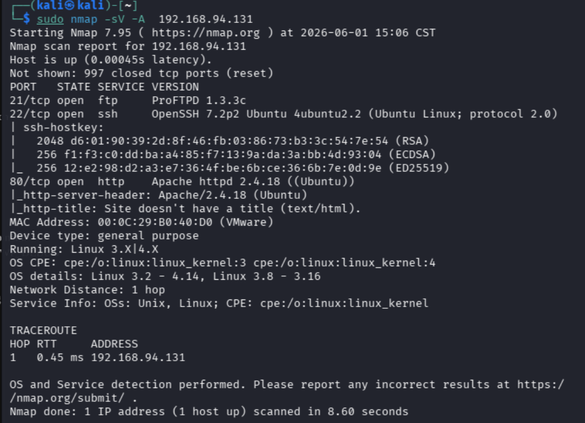
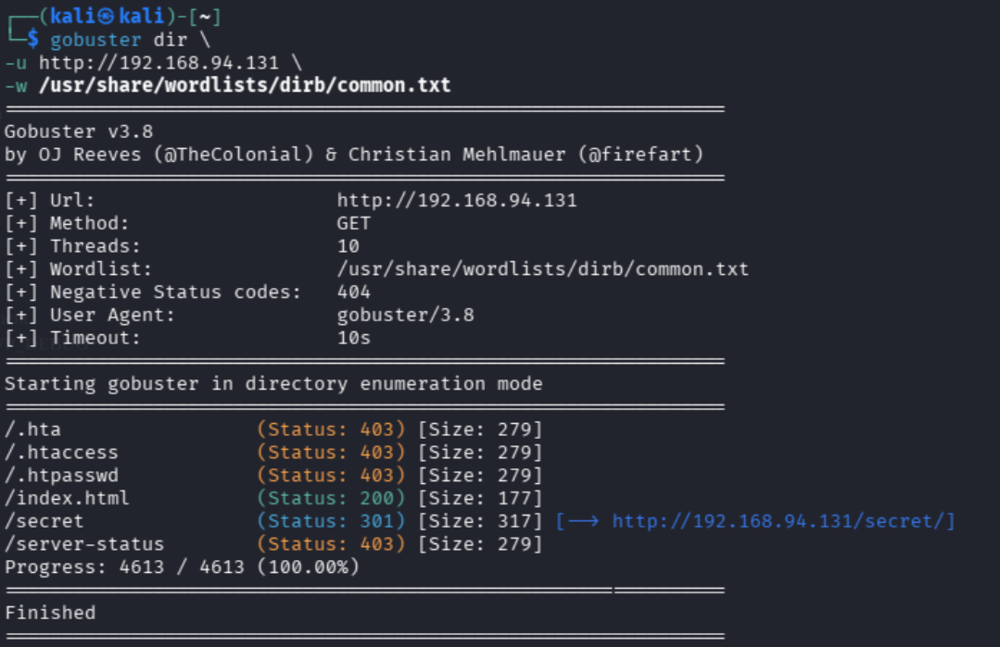
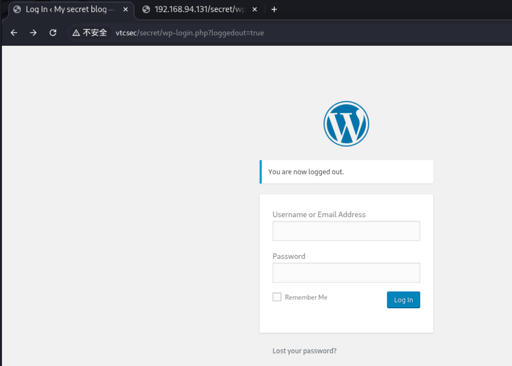
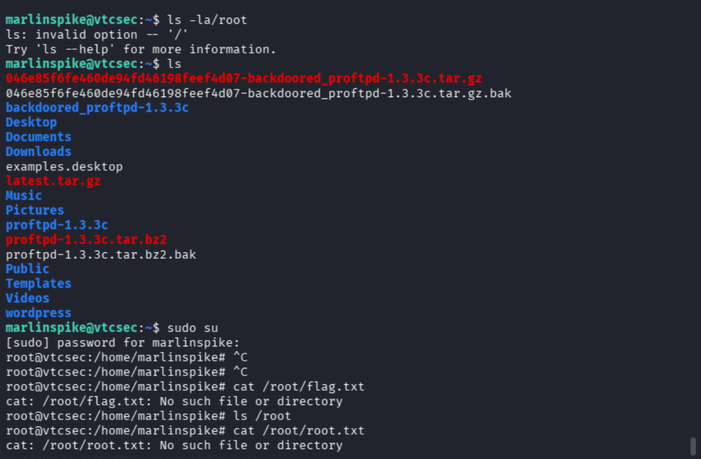

# VulnHub
# Basic Pentesting 1 Writeup

## 靶机信息

* 靶机名称：Basic Pentesting 1
* 平台：VulnHub
* 攻击机：Kali Linux
* 目标：获取 Root 权限

---

## 信息收集

### 主机扫描

首先使用 Nmap 对目标主机进行扫描，识别开放端口及运行服务。

```bash
nmap -sV <Target-IP>
```

扫描结果发现目标开放多个服务，其中 Web 服务可正常访问，因此优先从 Web 应用开始进行分析。


---

## Web 枚举

### 访问 Web 服务

通过浏览器访问目标 HTTP 服务，页面能够正常打开，但没有发现明显的可利用信息。

### 目录枚举

为了进一步发现隐藏资源，使用 Gobuster 对网站目录进行枚举。

```bash
gobuster dir -u http://<Target-IP> -w /usr/share/wordlists/dirb/common.txt
```

通过目录扫描发现隐藏页面。


### 发现隐藏功能

访问隐藏页面后，发现后台登录入口。



---

## 获取初始访问权限

通过对后台功能进行分析，成功获取初始访问权限。

进入后台后，对系统信息进行进一步收集，并分析目标环境中可能存在的可利用点。

在此过程中，曾尝试部分利用方式，但未取得预期效果，因此重新调整思路，继续进行信息收集。

最终成功获得系统中的有效用户信息，并获取更高权限账户访问能力。

---

## 权限提升

在获得普通用户权限后，对系统权限配置进行分析。

结合 Linux 权限机制，成功完成权限提升，最终获得 Root 权限。

```bash
whoami
root
```


---

## 遇到的问题

在获取初始访问权限后，最开始尝试的利用思路并未成功。

随后重新进行信息收集，并对目标环境进行分析，通过调整攻击思路最终完成后续利用过程。

通过本次实验，进一步认识到：

* 信息收集的重要性；
* 遇到失败时需要及时调整思路；
* 完整渗透测试流程比单个漏洞利用更加重要。

---

## 总结

本次实验完整经历了：

* 信息收集；
* 服务识别；
* 目录枚举；
* 获取初始访问权限；
* 权限提升；
* 获取 Root 权限。

通过 Basic Pentesting 1 靶机实践，对渗透测试的基本流程有了更加直观的认识。

同时进一步熟悉了：

* Nmap 主机扫描；
* Gobuster 目录枚举；
* Linux 基础操作；
* Web 应用信息收集；
* 权限提升基本思路。

本次实验更加关注渗透测试流程与问题分析过程，而不仅仅是单一漏洞利用。

后续将继续学习更多靶机环境，并持续整理实验记录与学习笔记。
